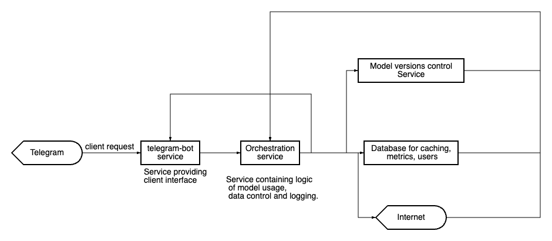

# ML System Design Doc 
# ML System Design Doc - VocalShift
## 1. Objectives and Background
### 1.1. Why engage in product development?

- **Business Objective:** The primary goal of this project is to create a chatbot that can generate AI song cues using a neural network, thereby revolutionizing the music industry by offering personalized music experiences to users.

- **Improvement over Current State:** This project aims to provide a significant improvement over the current state by enabling users to replace the artist's voice in any song while maintaining audio quality and emotional authenticity.

- **Success Criteria:** Success for this project, from a business perspective, will be measured by the achievement of key performance indicators (KPIs), including an increase in user engagement, an increase in premium subscriptions, and a 95% customer satisfaction rating.

### 1.2 Business Requirements and Constraints

- **Brief Description of Business Requirements:** Detailed business requirements have been provided by the Product Owner, including the need for real-time AI song cue generation, integration with popular music streaming platforms, and scalability to handle millions of concurrent users.

- **Business Constraints:** The project must adhere to a budget of $0 and must be launched within 3-4 months to align with market demand.

- **Iteration Success Criteria:** Each iteration must meet specific success criteria defined by the Product Owner, such as achieving a minimum user adoption rate of 5% for new features.

- **Pilot Business Process:** During the pilot phase, the AI song cues will be integrated into telegram chat with the ability for the user to select unique voices for songs and share them with their contacts.

- **Successful Pilot:** The pilot will be considered successful if user engagement increases within three months of deployment, with a retention rate of 90%. Potential paths for project expansion include exploring partnerships with major record labels.

### 1.3. Project Scope

- **In-Scope for Current Iteration:** The current iteration will focus on implementing specific business requirements outlined in the documentation provided by the Product Owner.
- **Out-of-Scope for Current Iteration:** Certain features or requirements may not be addressed in the current iteration.
- **Code Quality and Reproducibility:** The Data Scientist will ensure code quality and the reproducibility of the solution.
- **Technical Debt:** A description of any technical debt that may be incurred during the project and what will be deferred for future productization.

- **In-Scope for Current Iteration:** The current iteration will focus on creating a basic MVP with the ability to load any melody and select a new performer’s voice for it from the list of available ones.

- **Out-of-Scope for Current Iteration:** Advanced features like emotion customization and internationalization will not be addressed in the current iteration.

- **Code Quality and Reproducibility:** The Data Scientist will ensure code quality by following industry best practices and ensuring that the code is well-documented and version-controlled. Reproducibility will be achieved by sharing code, model weights, and data sources.

- **Technical Debt:** Technical debt will be minimized, but certain optimizations may be deferred for future iterations to meet the project timeline.

### 1.4. Solution Assumptions

- **General Solution Assumptions:** The system will rely on certain assumptions related to data sources, forecast horizon, model granularity, and other factors, as justified by business requirements.

- **Data Blocks:** The system relies on data blocks such as audio recordings, lyrics, and emotion metadata to train and generate AI song cues.

- **Forecast Horizon:** The model's forecast horizon aligns with the real-time requirements, ensuring a seamless user experience.

- **Granularity of Model:** The model's granularity aligns with the requirements defined by the Product Owner, capturing subtle nuances in the music.

### 1.5 Use Case for VocalShift Chatbot

#### 1.5.1 Overview

The VocalShift chatbot is designed to provide users with a unique and personalized music experience by allowing them to replace the original artist's voice in any song with that of a different performer while preserving audio quality and emotional authenticity. This use case outlines a scenario in which a user interacts with the VocalShift chatbot to create a personalized song cue.

#### 1.5.2. Actors

- **User:** The individual interacting with the VocalShift chatbot to generate a personalized song cue.

#### 1.5.3. Preconditions

- The VocalShift chatbot is integrated into a messaging platform, such as Telegram.
- The user has access to the chatbot and understands its basic functionalities.

#### 1.5.4. Main Flow

##### 1.5.4.1. User Interaction

1. **User Opens Chatbot:**
   - The user opens the chatbot on their preferred messaging platform.

2. **Selects Song:**
   - The user provides the chatbot with the name or details of the song they want to personalize.

3. **Chooses Vocal Performer:**
   - The chatbot presents the user with a list of available vocal performers.
   - The user selects a specific performer whose voice they want to replace in the chosen song.

4. **Initiates Song Cue Generation:**
   - The user instructs the chatbot to generate the personalized song cue.

##### 1.5.4.2. VocalShift Processing

5. **Audio Processing:**
   - VocalShift processes the selected song, extracting the original vocals and preparing the instrumental part.

6. **Vocal Replacement:**
   - The neural network model replaces the original vocals with the chosen performer's voice, maintaining pitch and intonation.

7. **Quality Assurance:**
   - VocalShift evaluates the quality of the generated song cue using metrics such as MOS, WER, F0 RMSE, and MFCC Distance.

##### 1.5.4.3. User Feedback

8. **Song Playback:**
   - The chatbot provides the user with a preview of the personalized song cue.

9. **User Satisfaction Survey:**
   - The chatbot prompts the user to provide feedback on their satisfaction with the generated song cue.

#### 1.5.5. Postconditions

- The user receives a personalized song cue with the vocals replaced by the chosen performer.
- User feedback is collected for continuous improvement.

#### 1.5.6. Alternative Flows

##### 1.5.6.1. User Wants to Share the Song

- If the user wants to share the generated song, the chatbot provides options to share the audio file or a link to the personalized song cue on social media or messaging platforms.

##### 1.5.6.2. User Wants to Explore Advanced Features

- If the user expresses interest in advanced features (e.g., emotion customization, internationalization), the chatbot informs them that these features are planned for future iterations.

#### 1.5.7. Success Scenario

- The user successfully generates a personalized song cue with the desired vocal performer.
- User engagement increases, and the chatbot receives positive feedback on the quality and uniqueness of the personalized song cues.

#### 1.5.8. Failure Scenario

- The chatbot encounters technical issues during song cue generation, resulting in a poor-quality output.
- User satisfaction decreases, and feedback indicates dissatisfaction with the personalized song cue.

## 2. Methodology 
### 2.1. Problem statement
The task of extracting vocals from a song and converting it into another vocal voice while maintaining pitch and intonation utilizing artificial intelligence.

### 2.2. Block diagram of the solution 

### 2.3. Stages of solving the problem

#### 2.3.1 Metrics Selection
Offline metrics are measures that evaluate the quality of vocal track generation based on historical data and expert assessments.

- **MOS (Mean Opinion Score):** The average quality rating of vocal track generation on a five-point scale, obtained from experts or users.

- **WER (Word Error Rate):** The percentage of errors in recognizing words in the generated track compared to the original song lyrics.

- **F0 RMSE (Fundamental Frequency Root Mean Square Error):** The root mean square error in determining the fundamental frequency of sound in the generated track compared to the original.

- **MFCC (Mel-Frequency Cepstral Coefficients) Distance:** The distance between the spectral characteristics of sound in the generated and target tracks.

Online metrics are measures that can be obtained while the system is in operation.

- **CSAT (Customer Satisfaction Score):** The percentage of users who rated their experience with the chatbot as positive.

- **NPS (Net Promoter Score):** The percentage of users willing to recommend the chatbot to their friends or acquaintances.

- **Retention Rate:** The percentage of users who return to using the chatbot after their initial interaction.

- **Conversion Rate:** The percentage of users who switch to the paid version of the chatbot after using the free version.

Technical metrics are related to the system's performance and speed.

- **Latency:** The time the system takes to process a user's request and generate a response.

- **Throughput:** The number of requests the system can process per unit of time.

- **Availability:** The percentage of time when the system is available and functioning correctly.

- **Error Rate:** The percentage of requests that the system couldn't process or processed incorrectly.

The selection of these metrics allows us to assess the system's effectiveness from various angles, including generation quality, user satisfaction, and system performance. This will enable us to make more informed decisions and enhance the chatbot in line with project requirements and business objectives.

#### 2.3.2. Object and target
Object is a song with the original vocal track.

Target variable is a song with a vocal track replaced by different artist

#### 2.3.3. Data
The data are blocks linking audio tracks annotated with song lyrics and emotion metadata.

#### 2.3.4. Data preparation
Data preparation consists of uploading the trained models to the server and connecting them to the bot itself. Also converting input audio files to WAV format and back to mp3 format output data. Splitting the input audio track into instrumental and vocal parts.

## 3. Pilot Preparation

### 3.1. Pilot Evaluation Method

To evaluate the success of the pilot project of our chatbot the following method is proposed:

In the existing system, we will add a chatbot capable of changing the vocal track in a song to match a different artist's performance. This chatbot will be accessible to users through various chat platforms.

To assess the bot's effectiveness, we will utilize AB testing. One group of users will have access to the chatbot with the new functionality (Group A), while the other group will use the regular chatbot without this feature (Group B).

To evaluate effectiveness, we will collect the following data:

- The number of users using the new functionality.
- The number of sessions in which the new feature was used.
- User satisfaction expressed through surveys and feedback.
- The quality of audio tracks created using the new functionality (evaluated by the audience).
- The time users spend on the platform with the new functionality.

To analyze effectiveness, we will compare the metrics of Group A with those of Group B. It's important to note that we might not have a good online metric so we will rely on proxy metrics such as user satisfaction and audio track quality.

### 3.2. What We Consider a Successful Pilot

We will consider the pilot successful if the following criteria are met:

- An increase in the number of users using the new functionality by at least X% compared to Group B.
- An increase in the average time users spend on the platform with the new functionality.
- User satisfaction (measured by surveys and feedback) should not worsen and may even improve.
- The quality of audio tracks created using the new functionality should be assessed as not inferior to the quality of audio tracks created using the old functionality.
- There should be no significant technical failures or security issues.

If all these criteria are met, the pilot will be considered successful, and we can proceed with the implementation of the new chatbot functionality. Otherwise, we will need to analyze the results, identify issues, and make improvements to the system.

In addition to these success criteria, we will also take into account the return on investment. We will assess how long it will take for the system to become profitable and what the expected income will be from attracting new users using the new functionality.

### 3.3. Pilot Preparation

Preparing the pilot for the VocalShift project involves the following steps:

- **Computational Complexity Assessment:** We will analyze the expected computational load that the chatbot will generate when processing and altering vocal tracks in songs. We will determine the resources (processor, memory, storage) required to ensure smooth and fast bot operation.

- **Baseline Experiment:** Before launching the pilot, we will conduct experiments with the baseline version of the chatbot, which does not include the new functionality for changing vocal tracks. We will assess the performance and computational resources needed for handling regular user requests.

- **Setting Computational Complexity Limits for Models:** If we find that the new functionality significantly increases the computational load, we will set limits on the use of this feature. For instance, we may restrict access to it only for premium subscribers or limit the number of simultaneous requests.

- **Scalability Assessment:** If we discover that the chatbot with the new functionality could face increased popularity and load, we will explore scalability options. This may include the use of cloud resources or optimizing the system architecture.

- **Technical Support Evaluation:** We will prepare the necessary technical infrastructure to support the chatbot in the pilot version. This includes performance monitoring, data backups, and addressing any issues that may arise during the pilot.

- **Estimated Costs Calculation:** We will estimate the budget for preparing and conducting the pilot, including expenses for computational resources, development, testing, and monitoring. These costs will be part of the project's success evaluation.

- **Monitoring Plan Development:** We will establish a monitoring system that tracks the chat bot's performance in real-time. This will enable us to promptly address any issues and improve the bot's operation.

This section of pilot preparation will help ensure the smooth integration of new functionality into the chat bot and minimize risks associated with computational and technical aspects of the project.

### 3.4. Sytem scaling

The scaling of the system depends on the number of users of the bot itself. So this number can vary from one user to 10000, depending on the social success of the bot, but we believe that more than one machine will not be needed to launch the prototype and its success in the first quarter. 

### 3.5 System expansion potential

This system can be extended by using large clusters of servers to be managed by schedulers and orchestrators such as airflow, for example. You should also consider loading and shipping speeds, and separate dials in operations so that you don't create collisions in the machine orchestrators.

## 4. Realization

### 4.1 Service Development
Docker Compouser will be used to orchestrate the project's services, and a standard Python application for working with a Telegram bot will be used to work with Telegram.   
The orchestrator of the model's work will be a Python application built using the Celery distributed computing library.   
Redis will be used in the database for speed of deployment, with the possibility of moving to Postgres in the future.
### 4.2 Model Development

The requirements for service operation, including CPU, RAM, disk, network bandwidth, and hardware, are critical considerations for the successful deployment and functioning of the VocalShift chatbot with AI song cue generation. Here's an overview of the requirements:

### 4.3 Service Operation Requirements:

#### 4.3.1. **CPU (Central Processing Unit):**
   - **Minimum Requirement:** Quad-core processor (e.g., Intel Core i5 or equivalent)
   - **Recommended:** Hexa-core or higher for optimal performance during AI processing

#### 4.3.2. **RAM (Random Access Memory):**
   - **Minimum Requirement:** 8 GB
   - **Recommended:** 16 GB or higher for handling large datasets and concurrent user requests efficiently

#### 4.3.3. **Disk Storage:**
   - **Minimum Requirement:** 100 GB SSD
   - **Recommended:** 250 GB SSD or higher for storage of models, audio files, and other data

#### 4.3.4. **Network Bandwidth:**
   - **Minimum Requirement:** 100 Mbps
   - **Recommended:** 1 Gbps or higher for handling real-time data transfer and requests

#### 4.3.5. **Hardware:**
   - **GPU (Graphics Processing Unit):** A dedicated GPU (e.g., NVIDIA GeForce or Quadro series) for accelerated AI processing
   - **Network Interface Card (NIC):** Gigabit Ethernet or faster for efficient communication

### 4.4 High Load Requirements:

In case of high load on the service, additional resources may be required to ensure responsiveness and reliability. The following are heightened requirements during peak usage:

#### 4.4.1. **CPU:**
   - **Recommended:** Scaling horizontally by adding more CPU cores or instances

#### 4.4.2. **RAM:**
   - **Recommended:** Scaling vertically by adding more RAM to existing instances or scaling horizontally by adding more instances

#### 4.4.3. **Disk Storage:**
   - **Recommended:** Scaling horizontally by distributing storage load or adding more storage capacity

#### 4.4.4. **Network Bandwidth:**
   - **Recommended:** Scaling vertically by increasing bandwidth or load balancing across multiple servers

#### 4.4.5. **Hardware:**
   - **GPU:** Consider upgrading to more powerful GPUs or adding multiple GPUs for parallel processing
   - **NIC:** Scaling horizontally with load balancing for network traffic distribution

### 4.5 ML System Scaling:

#### 4.5.1. **Scalability Assessment:**
   - Evaluate the expected load and scalability options, considering cloud resources for on-demand scaling.

#### 4.5.2. **Scaling Plan:**
   - Define a scaling plan based on user numbers, such as automatic scaling in cloud environments.

#### 4.5.3. **Infrastructure:**
   - Consider using containerization (e.g., Docker) and orchestration tools (e.g., Kubernetes) for efficient resource management.

#### 4.5.4. **Monitoring:**
   - Implement real-time monitoring to track system performance, resource usage, and user interactions.

#### 4.5.5. **Cost Optimization:**
   - Optimize costs by utilizing cloud resources efficiently and considering reserved instances for stable workloads.

### 4.6 System Expansion Potential:

The VocalShift system has the potential for expansion based on its success. Considerations for system expansion include:

#### 4.6.1. **Clustered Servers:**
   - Use large clusters of servers managed by schedulers (e.g., Apache Airflow) for efficient workload distribution.

#### 4.6.2. **Orchestration:**
   - Implement schedulers and orchestrators to manage tasks, avoiding collisions in machine orchestrators.

#### 4.6.3. **Load Balancing:**
   - Implement load balancing mechanisms to distribute incoming requests evenly across multiple servers.

#### 4.6.4. **Operations Separation:**
   - Separate operational functions to prevent collisions in machine orchestrators and ensure smooth system operation.
